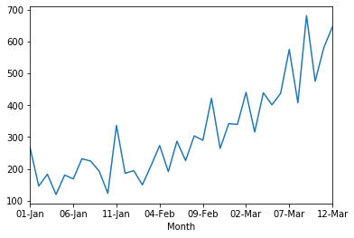
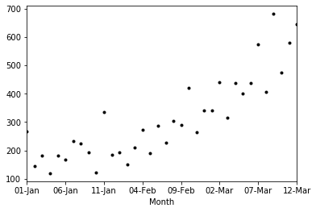
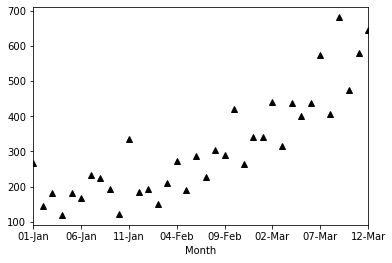
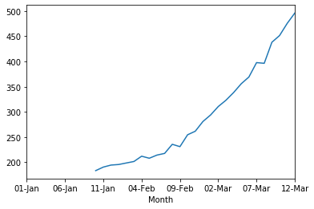
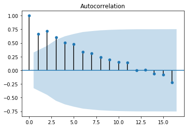
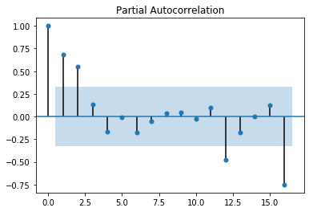

```python
import pandas as pd
import matplotlib.pyplot as plt
%matplotlib inline

# this last line help to reduce the code like if don't have then we need to do some more code (plt.show()) 
# i just want to optimize the process with the help of %matplotlib inline
```


```python
# i just load this file no need to wirte a path because im working with same folder where file is available (/)

shampoo = pd.read_csv('shampoo.csv')
```


```python
shampoo.head()
```


<div>
<style scoped>
    .dataframe tbody tr th:only-of-type {
        vertical-align: middle;
    }

    .dataframe tbody tr th {
        vertical-align: top;
    }

    .dataframe thead th {
        text-align: right;
    }
</style>
<table border="1" class="dataframe">
  <thead>
    <tr style="text-align: right;">
      <th></th>
      <th>Month</th>
      <th>Sales</th>
    </tr>
  </thead>
  <tbody>
    <tr>
      <td>0</td>
      <td>01-Jan</td>
      <td>266.0</td>
    </tr>
    <tr>
      <td>1</td>
      <td>02-Jan</td>
      <td>145.9</td>
    </tr>
    <tr>
      <td>2</td>
      <td>03-Jan</td>
      <td>183.1</td>
    </tr>
    <tr>
      <td>3</td>
      <td>04-Jan</td>
      <td>119.3</td>
    </tr>
    <tr>
      <td>4</td>
      <td>05-Jan</td>
      <td>180.3</td>
    </tr>
  </tbody>
</table>
</div>


```python
type(shampoo)
```


    pandas.core.frame.DataFrame


```python
# as we see this a dataframe but we need time series

# if want to know what type of parameters they want to use shift+tab+tab

# in interview they asked how you will import csv file as a time series 
# we use index_col --- we use 0 because our data column index is 0 position 
# parse_dates --- True (means we want this column it will be a proper data)
# squeeze --- True (help to convert in time series)


shampoo = pd.read_csv('shampoo.csv', index_col = [0], parse_dates = True, squeeze = True)
```


```python
type(shampoo)
```


    pandas.core.series.Series


```python
shampoo.head()
```


    Month
    01-Jan    266.0
    02-Jan    145.9
    03-Jan    183.1
    04-Jan    119.3
    05-Jan    180.3
    Name: Sales, dtype: float64


```python
# we plot a line on shampoo series
# pandas have inbliuld function help to plot 

shampoo.plot()
```


    <matplotlib.axes._subplots.AxesSubplot at 0x7fcdf3fbea90>





```python
# we also change the style of the plot
# here i csn show you
# just add style parameter and k(*,^,+,.,etc) in a string it will show you 

shampoo.plot(style = 'k.')
```


    <matplotlib.axes._subplots.AxesSubplot at 0x7fcdf4b23950>





```python
shampoo.plot(style = 'k^')
```


    <matplotlib.axes._subplots.AxesSubplot at 0x7fcdf4ab9f10>





```python
# if we want to know how many row we have 
# size give the count of rows

shampoo.size
```


    36


```python
# shape also give same output
shampoo.shape
```


    (36,)


```python
# there are two imp. thing after discribe or any other end with '()' is name is method
# and like shape , size this kind is called property

# describe help to see the statical analysis like center of central tendency

shampoo.describe()
```


    count     36.000000
    mean     312.600000
    std      148.937164
    min      119.300000
    25%      192.450000
    50%      280.150000
    75%      411.100000
    max      682.000000
    Name: Sales, dtype: float64


```python
# if we doing time seies one of the process is smoothing analysis
# it not a big thing it is just we caculating the moving average

shampoo_MA = shampoo.rolling(window = 10).mean()
```


```python
shampoo_MA.plot()

# here we see this curve is very smooth and moving avg. (MA) is mostly used in stock market analysis 

# this curve is just for the presentation 
# here i create a baseline model like how i calculate the moving avg.
```


    <matplotlib.axes._subplots.AxesSubplot at 0x7fcdf4c29f90>





```python
shampoo.head()
```


    Month
    01-Jan    266.0
    02-Jan    145.9
    03-Jan    183.1
    04-Jan    119.3
    05-Jan    180.3
    Name: Sales, dtype: float64


### here window = 10 means we take 0 to 9 valeus from the head and taking moving averge on it and after the we calcualte the next months data


```python
# there are three name of this like :

# what is baseline model, what is naive model and what is starting model

# in this model everyone creates what is in like we Previous value is the best refector of the next value
# like 266 is the best reflector or like predictor for 02 jan


```


```python
# shift method help you to shift the value to the next

shampoo_baseline_Model = pd.concat([shampoo,shampoo.shift(1)], axis = 1)
```


```python
shampoo_baseline_Model.head()
```


<div>
<style scoped>
    .dataframe tbody tr th:only-of-type {
        vertical-align: middle;
    }

    .dataframe tbody tr th {
        vertical-align: top;
    }

    .dataframe thead th {
        text-align: right;
    }
</style>
<table border="1" class="dataframe">
  <thead>
    <tr style="text-align: right;">
      <th></th>
      <th>Sales</th>
      <th>Sales</th>
    </tr>
    <tr>
      <th>Month</th>
      <th></th>
      <th></th>
    </tr>
  </thead>
  <tbody>
    <tr>
      <td>01-Jan</td>
      <td>266.0</td>
      <td>NaN</td>
    </tr>
    <tr>
      <td>02-Jan</td>
      <td>145.9</td>
      <td>266.0</td>
    </tr>
    <tr>
      <td>03-Jan</td>
      <td>183.1</td>
      <td>145.9</td>
    </tr>
    <tr>
      <td>04-Jan</td>
      <td>119.3</td>
      <td>183.1</td>
    </tr>
    <tr>
      <td>05-Jan</td>
      <td>180.3</td>
      <td>119.3</td>
    </tr>
  </tbody>
</table>
</div>


```python
# here i see i have done the shifting part but the column names are same we have the change the name

shampoo_baseline_Model.columns
```


    Index(['Sales', 'Sales'], dtype='object')


```python
# im using same method which a use in previous code

shampoo_baseline_Model.columns = ['Actual_sales', 'Forecast_sales']
```


```python
shampoo_baseline_Model.head()
```


<div>
<style scoped>
    .dataframe tbody tr th:only-of-type {
        vertical-align: middle;
    }

    .dataframe tbody tr th {
        vertical-align: top;
    }

    .dataframe thead th {
        text-align: right;
    }
</style>
<table border="1" class="dataframe">
  <thead>
    <tr style="text-align: right;">
      <th></th>
      <th>Actual_sales</th>
      <th>Forecast_sales</th>
    </tr>
    <tr>
      <th>Month</th>
      <th></th>
      <th></th>
    </tr>
  </thead>
  <tbody>
    <tr>
      <td>01-Jan</td>
      <td>266.0</td>
      <td>NaN</td>
    </tr>
    <tr>
      <td>02-Jan</td>
      <td>145.9</td>
      <td>266.0</td>
    </tr>
    <tr>
      <td>03-Jan</td>
      <td>183.1</td>
      <td>145.9</td>
    </tr>
    <tr>
      <td>04-Jan</td>
      <td>119.3</td>
      <td>183.1</td>
    </tr>
    <tr>
      <td>05-Jan</td>
      <td>180.3</td>
      <td>119.3</td>
    </tr>
  </tbody>
</table>
</div>


```python
# here i see we have a na value so we remove it

shampoo_baseline_Model.dropna(inplace = True)
```


```python
# here i import the mean_sqquared_error for see the error vlaues

import numpy as np
from sklearn.metrics import mean_squared_error
```


```python
shampoo_error = mean_squared_error(shampoo_baseline_Model.Actual_sales, shampoo_baseline_Model.Forecast_sales)
```


```python
shampoo_error
```


    11715.388285714285


```python
# here i see we not comapre with our values so we need to sqrt of this value

np.sqrt(shampoo_error)
```


    108.23764726616282


```python
# as we see 108 is error with the help of baseline model 
# we have also doing some more model to find what give us the minimum error
# ARIMA model, Moving averge , auto regressor

# in. this time most of the people use ARIMA modle because it is integrated with auto regressor and moving avg.
# we also find AR and MA with the help of ARIMa model like

# ARIMA(p,d,q) 
# p is for auto regresor and q is for moving avg and d is for Difference 

#if i want to create auto regression i just put one value here i show you
# ARIMA(2,0,0)


#if i want to create moving Average i just put one value here i show you like this
# ARIMA(0,0,2) 

# we calculate auto regression and moving Average with acf and pacf 
# pacf is for p like auto regreesive and acf is for moving avg.


```


```python
# this library help to acf and pacf

from statsmodels.graphics.tsaplots import plot_acf,plot_pacf
```


```python
plot_acf(shampoo)
```





```python
plot_pacf(shampoo)
```





```python
# here i see the corelation between them it wil decresed
# so the blue color show the critical range outside of the critical range we take as a no.
# start counting with 0 


#  like acf (q) == moving avg. (3)
#. like pacf (p) == auto regresive (2)
#. usually d is stand between 0-2 

```


```python
from statsmodels.tsa.arima_model import ARIMA


```


```python
# here we do train and test but not taking ramdon data here we take sequentially data

shampoo_train = shampoo[0:25]
shampoo_test = shampoo[25:36]
```


```python
shampoo_ARIMA_model = ARIMA(shampoo_train, order = (3,1,2))


# here we give the values is not consistent so we do some other combination on it
```

    /Users/rishabhraibhandar/opt/anaconda3/lib/python3.7/site-packages/statsmodels/tsa/base/tsa_model.py:215: ValueWarning: An unsupported index was provided and will be ignored when e.g. forecasting.
      ' ignored when e.g. forecasting.', ValueWarning)
    /Users/rishabhraibhandar/opt/anaconda3/lib/python3.7/site-packages/statsmodels/tsa/base/tsa_model.py:215: ValueWarning: An unsupported index was provided and will be ignored when e.g. forecasting.
      ' ignored when e.g. forecasting.', ValueWarning)


```python
# here i remove this warning

import warnings
warnings.filterwarnings('ignore')
```


```python
shampoo_arima_modelfit = shampoo_ARIMA_model.fit()
```


```python
shampoo_arima_modelfit.aic
```


    272.38919480718425


### The AIC function is 2K – 2(log-likelihood). Lower AIC values indicate a better-fit model, and a model with a delta-AIC (the difference between the two AIC values being compared) of more than -2 is considered significantly better than the model it is being compared to.


```python
shampoo_forecast = shampoo_arima_modelfit.forecast(steps = 11)[0]


```


```python
np.sqrt(mean_squared_error(shampoo_test,shampoo_forecast))

# it is higher then the baseline model so our baseline move have a less error as comapre to ARIMA modle
```


    130.9269055976984


```python
p_values = range(0,5)
d_values = range(0,3)
q_values = range(0,5)
```


```python
for p in p_values:
    for d in d_values:
        for q in q_values:
            order = (p,d,q)
            train, test = shampoo[0:25], shampoo[25:36]
            prediction = list()
            for i in range(len(test)):
                try:
                    model = ARIMA(train, order)
                    model_fit = model.fit(disp = 0)
                    pred_y = model_fit.forecast()[0]
                    prediction.append(pred_y)
                    error = np.sqrt(mean_squared_error(test, prediction))
                    print('ARIMA%s : RMSE %0.2f'% (order, error))
                except: 
                    continue
```

    ARIMA(0, 0, 0) : RMSE 279.20
    ARIMA(0, 0, 1) : RMSE 264.80
    ARIMA(0, 0, 2) : RMSE 242.01
    ARIMA(0, 0, 3) : RMSE 249.06
    ARIMA(0, 1, 0) : RMSE 183.98
    ARIMA(0, 1, 1) : RMSE 201.63
    ARIMA(0, 1, 2) : RMSE 185.77
    ARIMA(0, 2, 0) : RMSE 184.44
    ARIMA(0, 2, 1) : RMSE 168.50
    ARIMA(1, 0, 0) : RMSE 247.30
    ARIMA(1, 0, 1) : RMSE 215.71
    ARIMA(1, 0, 2) : RMSE 209.58
    ARIMA(1, 1, 0) : RMSE 178.01
    ARIMA(1, 1, 1) : RMSE 205.37
    ARIMA(1, 2, 0) : RMSE 137.28
    ARIMA(1, 2, 1) : RMSE 161.65
    ARIMA(2, 0, 0) : RMSE 212.72


```python
np.amin(error)
```


```python

```
